# 🎮 Tic-Tac-Toe Game

Welcome to the **Tic-Tac-Toe Game**! 🚀 Challenge a friend in this classic console-based game and see who can claim victory or force a draw. Keep track of your scores and have endless fun!

## 🌟 Features
- Two-player gameplay
- Score tracking for each player
- Announcement of winner or draw after each round

## 🕹️ How to Play
1. The game prompts players to enter their names.
2. The tic-tac-toe board is displayed, with Player 1 (X) starting the game.
3. Players take turns entering a number (1 to 9) to place their symbol on the board.
4. After each move, the game checks for a winner or a draw.
5. The result is announced, and players can choose to play again.

## 🎮 Game Controls
- Use numbers 1 to 9 to place your symbol on the corresponding board position.
- Follow on-screen instructions during your turn. 🎲

## 📜 Game Rules
- The first player to form a horizontal, vertical, or diagonal line with their symbol wins.
- If no player wins, the game ends in a draw.

## 🚀 Clone and Use Tic-Tac-Toe Game

### Step 1: Clone the Repository
Open your terminal and run the following command:
```bash
git clone https://github.com/B3TA-BLOCKER/Tic-Tac-Toe-Game.git
```

### Step 2: Navigate to the Project Folder
```bash
cd Tic-Tac-Toe-Game
```

### Step 3: Compile the Source Code
```bash
g++ main.cpp -o main
```

### Step 4: Execute the Program
```bash
./main
```
<br>

## 📝 Flowchart

```mermaid
graph TD;
    Start([Start]) --> |Enter Player Names| EnterNames[Enter Player 1 and Player 2 names]
    EnterNames --> DisplayBoard[Display Board]
    DisplayBoard --> GamePlay[Gameplay Loop]
    GamePlay --> Player1Turn[Player 1's Turn]
    Player1Turn --> CheckMove1{Valid Move?}
    CheckMove1 --> |No| InvalidMove1[Prompt Invalid Move]
    InvalidMove1 --> Player1Turn
    CheckMove1 --> |Yes| UpdateBoard1[Update Board with Player 1's Move]
    UpdateBoard1 --> CheckGame1{Game Won?}
    CheckGame1 --> |Yes| EndGame[End Game]
    CheckGame1 --> |No| CheckDraw1{Game Draw?}
    CheckDraw1 --> |Yes| EndGame
    CheckDraw1 --> |No| Player2Turn[Player 2's Turn]
    Player2Turn --> CheckMove2{Valid Move?}
    CheckMove2 --> |No| InvalidMove2[Prompt Invalid Move]
    InvalidMove2 --> Player2Turn
    CheckMove2 --> |Yes| UpdateBoard2[Update Board with Player 2's Move]
    UpdateBoard2 --> CheckGame2{Game Won?}
    CheckGame2 --> |Yes| EndGame
    CheckGame2 --> |No| CheckDraw2{Game Draw?}
    CheckDraw2 --> |Yes| EndGame
    CheckDraw2 --> Player1Turn
    EndGame --> PlayAgain{Play Again?}
    PlayAgain --> |Yes| ResetBoard[Reset Board]
    ResetBoard --> DisplayBoard
    PlayAgain --> |No| ThankYou[Thank You Message]
    ThankYou --> Exit[Exit]

    style Start fill:#333,stroke:#fff,stroke-width:2px;
    style Exit fill:#333,stroke:#fff,stroke-width:2px;
    style DisplayBoard fill:#444,stroke:#fff,stroke-width:2px;
    style GamePlay fill:#444,stroke:#fff,stroke-width:2px;
    style EndGame fill:#444,stroke:#fff,stroke-width:2px;
    style PlayAgain fill:#444,stroke:#fff,stroke-width:2px;
    style InvalidMove1 fill:#555,stroke:#fff,stroke-width:2px;
    style InvalidMove2 fill:#555,stroke:#fff,stroke-width:2px;
    style ThankYou fill:#555,stroke:#fff,stroke-width:2px;
```

<br>


<br>


